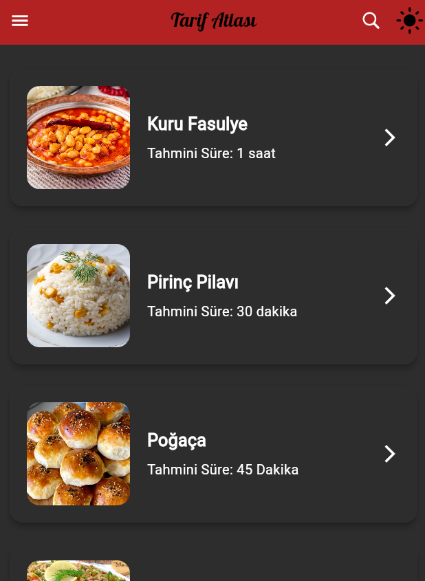

# Tarif Atlası

  


  

## Proje Hakkında

Tarif Atlası, kullanıcılara farklı kategorilerde yemek tariflerini keşfetme ve detaylarına erişme imkanı sunan bir uygulamadır. Proje, hem yemek tariflerini düzenli bir yapıda sunmayı hem de kolayca erişim sağlamayı amaçlamaktadır.

  

## Ekibimiz

-  **Danışman:**  
[https://github.com/keyvanarasteh](Keyvan Arasteh)


-  **Takım Üyeleri:**

-  **Esra Alkaya** [GitHub](https://github.com/esralkya)

  

## Özellikler

- Kategorilere göre yemek tariflerini filtreleme
- Her tarif için detaylı malzeme listesi ve yapılış aşamaları
- Kullanıcı dostu bir arayüz
- Hızlı erişim çubuğu ile popüler kategorilere kolay erişim
- Karanlık Mod

  

## Kullanılan Teknolojiler

- Flutter

- Dart

- [Diğer teknolojiler]

  

## Başlangıç

  

### Gereksinimler

- Flutter SDK (sürüm X.X.X)

- Dart SDK (sürüm X.X.X)

- [Diğer gerekli yazılımlar]

  

### Kurulum Adımları

1. Projeyi bilgisayarınıza indirin:

```bash

git  clone https://github.com/esralkya/TarifAtlasiii.git`

```

  

2. Proje klasörüne gidin:

```bash

cd TarifAtlasiii

```

  

3. Gerekli paketleri yükleyin:

```bash

flutter  pub  get

```

  

4. Uygulamayı başlatın:

```bash

flutter  run

```

  

## Proje Yapısı

```

lib/

├── modeller/ # Veri modelleri

├── ekranlar/ # Uygulama ekranları

├── widgets/ # Tekrar kullanılabilir arayüz öğeleri

├── servisler/ # API servisleri

└── yardımcılar/ # Yardımcı fonksiyonlar

```

  

### *Ekran Görüntüleri:*

<div align="center">


|:-:|:-:|
|  |  |
|:-:|:-:|
|  |  |
|:-:|:-:|
|  |  |


</div>

  

## Projeye Katkı Sağlama

1. Projeyi forklayın

2. Yeni bir dal oluşturun (`git checkout -b ozellik/YeniOzellik`)

3. Değişikliklerinizi kaydedin (`git commit -m 'Yeni özellik eklendi'`)

4. Dalınıza gönderin (`git push origin ozellik/YeniOzellik`)

5. Pull Request oluşturun

  

## Lisans

[Lisans türü] kapsamında lisanslanmıştır. Daha fazla bilgi için `LICENSE` dosyasını inceleyebilirsiniz.

  

## İletişim

- Proje Bağlantısı: [https://github.com/esralkya/TarifAtlasiii](https://github.com/esralkya/TarifAtlasiii)

- İstinye Üniversitesi: [https://www.istinye.edu.tr/](https://www.istinye.edu.tr/)

  

## Teşekkürler

- İstinye Üniversitesi'ne destekleri için teşekkür ederiz

- [Diğer teşekkürler]
